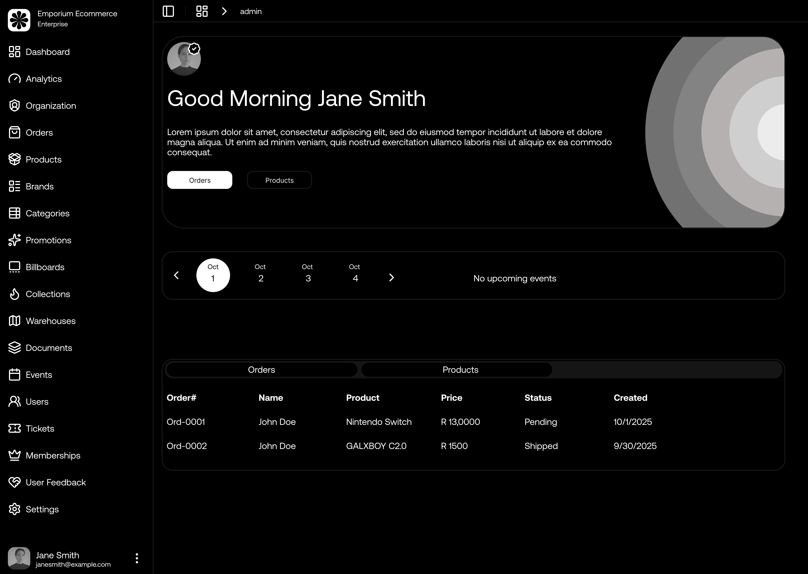
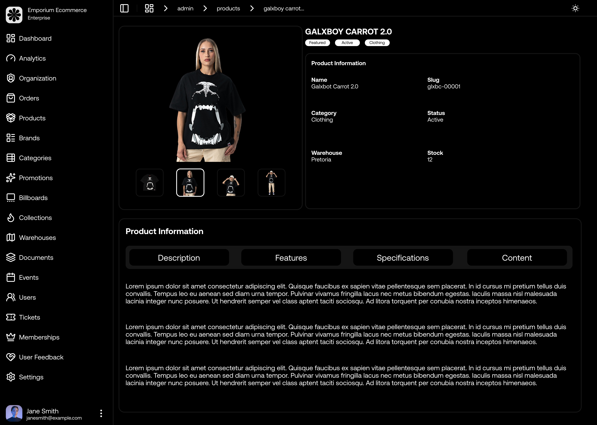

# Emporium Ecommerce Admin Dashboard

A comprehensive administrative interface for managing the Emporium Ecommerce ecommerce platform. Built with Next.js 15, TypeScript, and modern UI components for efficient store management.

## Overview

The Admin Dashboard provides a complete management system for ecommerce operations, featuring intuitive interfaces for product management, order processing, user administration, and business analytics. Designed for administrators, store managers, and content creators.

## Useful Links

- **Figma**: https://www.figma.com/community/file/1562431083007443606
- **Live Link**: https://emporium-ecommerce-dashboard-six.vercel.app

## Tech Stack

- **Framework**: Next.js 15 (App Router with Turbopack)
- **Language**: TypeScript
- **Styling**: Tailwind CSS v4
- **Database**: PostgreSQL with Prisma ORM
- **Authentication**: Better Auth with role-based access
- **UI Components**: Radix UI, ShadCN UI
- **Rich Text Editor**: BlockNote
- **File Management**: UploadThing
- **Data Visualization**: Recharts
- **Form Handling**: React Hook Form + Zod validation
- **Drag & Drop**: DND Kit
- **Animations**: Framer Motion

## Core Features

### Product Management

- **Product Catalog**: Create, update, and delete products with rich media support
- **Product Variants**: Manage swatches (colors, sizes, materials, etc.)
- **Inventory Control**: Real-time stock tracking and management
- **Bulk Operations**: Mass product updates and imports
- **Product Status**: Active, inactive, archived, coming soon states
- **SEO Optimization**: Meta tags, slugs, and search optimization

### Category & Brand Management

- **Categories**: Hierarchical category structure with active/inactive states
- **Brands**: Brand management with logo uploads and product associations
- **Collections**: Curated product collections for marketing campaigns
- **Warehouses**: Multi-location inventory management

### Order Management

- **Order Processing**: Complete order lifecycle management
- **Status Tracking**: Pending, confirmed, processing, shipped, delivered
- **Payment Integration**: Multiple payment gateway support
- **Order Analytics**: Revenue tracking and order insights
- **Customer Communication**: Automated order notifications

### User Administration

- **User Management**: Customer account administration
- **Role-Based Access**: Administrator, owner, member permissions
- **Membership Tiers**: Bronze, Silver, Gold, Platinum tier management
- **Points System**: Customer loyalty and rewards administration
- **User Analytics**: Customer behavior and engagement metrics

### Content Management

- **Billboards**: Dynamic promotional banners with featured products
- **Promotions**: Campaign management with brand associations
- **Documents**: File management system with categorization
- **Notes & Tasks**: Internal documentation and task management
- **Rich Text Editor**: BlockNote integration for content creation

### Analytics & Reporting

- **Dashboard Overview**: Key performance indicators and metrics
- **Sales Analytics**: Revenue, orders, and conversion tracking
- **Product Performance**: Best sellers and inventory insights
- **User Engagement**: Customer activity and retention metrics
- **Visual Charts**: Interactive data visualization with Recharts

### Feedback Management

- **Product Reviews**: Customer review moderation and management
- **Experience Feedback**: Overall platform experience tracking
- **Rating System**: 5-star rating management and analytics
- **Feedback Analytics**: Sentiment analysis and insights

### System Administration

- **Settings Management**: Platform configuration and preferences
- **Notification System**: Admin alerts and system notifications
- **Event Calendar**: Business events and scheduling
- **Organization Management**: Multi-tenant organization support

## Admin Structure

```
app/admin/
├── analytics/              # Business intelligence dashboard
├── billboards/             # Promotional banner management
│   ├── [billboardId]/     # Individual billboard operations
│   │   ├── delete/        # Billboard deletion
│   │   └── update/        # Billboard editing
│   └── create/            # New billboard creation
├── brands/                # Brand management
│   ├── [brandId]/         # Individual brand operations
│   └── create/            # New brand creation
├── categories/            # Category management
│   ├── [categoryId]/      # Individual category operations
│   └── create/            # New category creation
├── collections/           # Product collection management
├── documents/             # File and document management
│   ├── notes/             # Internal notes system
│   └── tasks/             # Task management
├── events/                # Event calendar management
├── feedback/              # Customer feedback management
│   ├── experiences/       # Experience reviews
│   └── reviews/           # Product reviews
├── memberships/           # Membership tier management
├── notifications/         # System notifications
├── orders/                # Order management system
├── organization/          # Multi-tenant management
├── products/              # Product catalog management
│   └── [productId]/
│       └── swatches/      # Product variant management
├── promotions/            # Marketing campaign management
├── settings/              # System configuration
├── users/                 # User administration
└── warehouses/            # Inventory location management
```

## Database Models

### Core Entities

- **User**: Administrator and customer accounts with role-based permissions
- **Product**: Complete product catalog with variants and inventory
- **Category**: Hierarchical product categorization
- **Brand**: Brand management with product associations
- **Order**: Complete order processing and tracking
- **Membership**: Customer loyalty tier system

### Content Management

- **Billboard**: Dynamic promotional content with featured products
- **Collection**: Curated product groupings
- **Promotion**: Marketing campaigns and brand promotions
- **Document**: File management with categorization
- **Note**: Internal documentation system
- **Task**: Administrative task management

### Analytics & Feedback

- **Review**: Product review system with moderation
- **Experience**: Platform experience feedback
- **Notification**: System-wide notification management
- **Event**: Business event and calendar management

## Authentication & Authorization

### Role-Based Access Control

- **Owner**: Full system access and configuration
- **Administrator**: Complete admin dashboard access
- **Member**: Limited administrative functions
- **User**: Customer-level access (excluded from admin)

### Security Features

- **Session Management**: Secure session handling with Better Auth
- **Route Protection**: Admin-only route access control
- **Permission Validation**: Granular permission checking
- **Audit Logging**: Administrative action tracking

## API Integration

### Admin API Routes

```
/api/admin/
├── billboard.ts           # Billboard management API
├── brand.ts              # Brand operations API
├── category.ts           # Category management API
├── collections.ts        # Collection operations API
├── dashboard.ts          # Analytics and metrics API
├── document.ts           # Document management API
├── event.ts              # Event management API
├── feedback.ts           # Review and feedback API
├── membership.ts         # Membership tier API
├── note.ts               # Notes management API
├── order.ts              # Order processing API
├── product.ts            # Product management API
├── promotion.ts          # Promotion management API
├── task.ts               # Task management API
├── user.ts               # User administration API
└── warehouse.ts          # Warehouse management API
```

## UI Components

### Admin-Specific Components

- **Data Tables**: Advanced table components with sorting, filtering, and pagination
- **Form Components**: Specialized admin forms with validation
- **Dashboard Widgets**: Analytics cards and metric displays
- **File Uploaders**: Multi-file upload with progress tracking
- **Rich Text Editors**: BlockNote integration for content creation
- **Modal Systems**: CRUD operation modals and confirmations

### Shared UI Components

- **Navigation**: Sidebar navigation with role-based menu items
- **Layout**: Responsive admin layout with header and sidebar
- **Charts**: Recharts integration for data visualization
- **Notifications**: Toast notifications and alert systems
- **Loading States**: Skeleton loaders and progress indicators

## Getting Started

### Prerequisites

- Admin or Owner role assignment
- Valid authentication credentials
- Database access with admin permissions

### Access Requirements

1. **Authentication**: Login with admin-level credentials
2. **Role Verification**: Ensure proper role assignment (admin/owner)
3. **Permission Check**: Verify access to admin routes
4. **Dashboard Access**: Navigate to `/admin` for main dashboard

### Initial Setup

1. **User Role Assignment**: Assign admin roles to authorized users
2. **Basic Configuration**: Set up categories, brands, and warehouses
3. **Product Catalog**: Import or create initial product inventory
4. **Membership Tiers**: Configure customer loyalty programs
5. **Payment Setup**: Configure payment gateway integrations

## Key Workflows

### Product Management Workflow

1. **Category Setup**: Create product categories and hierarchies
2. **Brand Management**: Add brands with logos and descriptions
3. **Warehouse Configuration**: Set up inventory locations
4. **Product Creation**: Add products with variants and media
5. **Inventory Management**: Track stock levels and updates
6. **SEO Optimization**: Configure meta tags and search settings

### Order Processing Workflow

1. **Order Reception**: New orders appear in admin dashboard
2. **Order Review**: Verify order details and payment status
3. **Inventory Check**: Confirm product availability
4. **Order Confirmation**: Update order status and notify customer
5. **Fulfillment**: Process shipping and tracking information
6. **Completion**: Mark orders as delivered and update analytics

### Content Management Workflow

1. **Billboard Creation**: Design promotional banners with featured products
2. **Collection Curation**: Group products for marketing campaigns
3. **Promotion Setup**: Create brand-specific promotional campaigns
4. **Content Publishing**: Activate content for public display
5. **Performance Tracking**: Monitor engagement and conversion metrics

## Analytics & Reporting

### Dashboard Metrics

- **Revenue Analytics**: Daily, weekly, monthly revenue tracking
- **Order Statistics**: Order volume, average order value, conversion rates
- **Product Performance**: Best sellers, inventory turnover, profit margins
- **Customer Insights**: User acquisition, retention, lifetime value
- **Inventory Status**: Stock levels, low inventory alerts, reorder points

### Reporting Features

- **Custom Date Ranges**: Flexible reporting periods
- **Export Capabilities**: CSV and PDF report generation
- **Visual Charts**: Interactive charts and graphs
- **Comparative Analysis**: Period-over-period comparisons
- **Real-time Updates**: Live dashboard updates

## Security & Compliance

### Data Protection

- **Input Validation**: Zod schema validation for all forms
- **SQL Injection Prevention**: Prisma ORM protection
- **XSS Protection**: Content sanitization and validation
- **File Upload Security**: Secure file handling with UploadThing
- **Session Security**: Secure session management

### Access Control

- **Route Protection**: Admin-only route access
- **Permission Validation**: Granular permission checking
- **Audit Trails**: Administrative action logging
- **Rate Limiting**: API request throttling
- **CSRF Protection**: Cross-site request forgery prevention

## Performance Optimization

### Frontend Performance

- **Code Splitting**: Route-based code splitting
- **Lazy Loading**: Component lazy loading
- **Image Optimization**: Next.js image optimization
- **Caching Strategies**: Browser and CDN caching
- **Bundle Optimization**: Tree shaking and minification

### Backend Performance

- **Database Optimization**: Query optimization and indexing
- **Caching Layer**: Redis caching for frequently accessed data
- **API Optimization**: Efficient data fetching and pagination
- **Background Jobs**: Async processing for heavy operations

## Troubleshooting

### Common Issues

- **Permission Denied**: Verify user role and permissions
- **Database Errors**: Check database connection and migrations
- **File Upload Issues**: Verify UploadThing configuration
- **Authentication Problems**: Check Better Auth setup
- **Performance Issues**: Monitor database queries and caching

### Debug Tools

- **Console Logging**: Comprehensive error logging
- **Database Monitoring**: Query performance tracking
- **API Testing**: Built-in API testing tools
- **Error Boundaries**: React error boundary implementation

## Support & Maintenance

### Regular Maintenance

- **Database Backups**: Automated backup procedures
- **Security Updates**: Regular dependency updates
- **Performance Monitoring**: Continuous performance tracking
- **User Feedback**: Regular admin user feedback collection

### Support Channels

- **Documentation**: Comprehensive admin documentation
- **Issue Tracking**: GitHub issue management
- **Community Support**: Developer community forums
- **Professional Support**: Enterprise support options

## Future Enhancements

### Planned Features

- **Advanced Analytics**: Machine learning insights
- **Mobile Admin App**: Native mobile administration
- **API Webhooks**: External system integrations
- **Multi-language Support**: Internationalization
- **Advanced Permissions**: Granular permission system
- **Automated Workflows**: Business process automation
